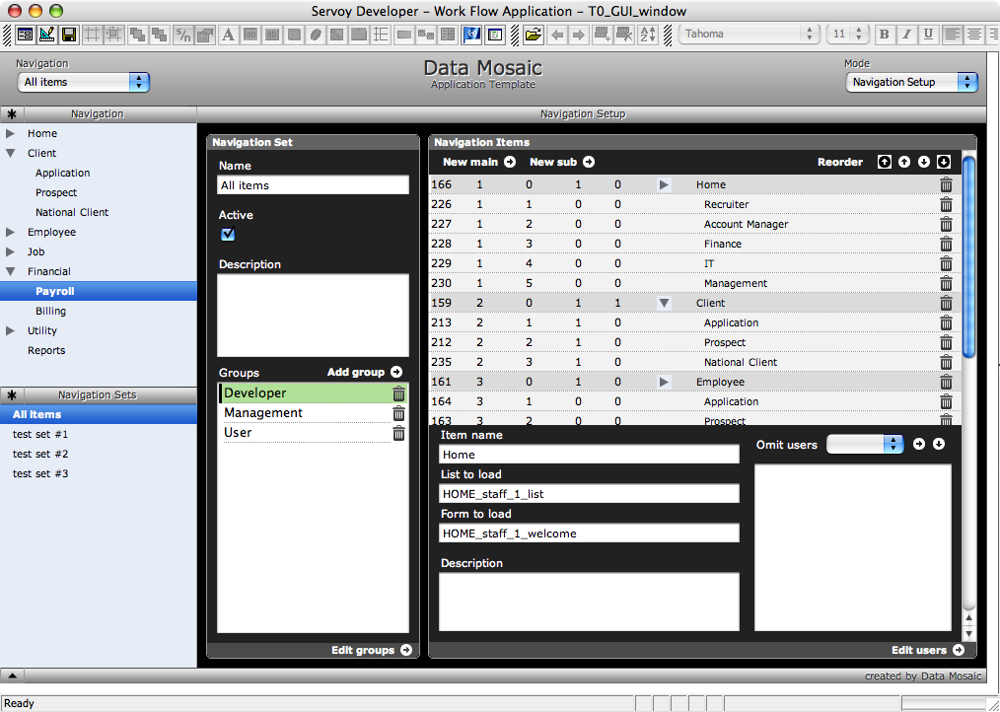
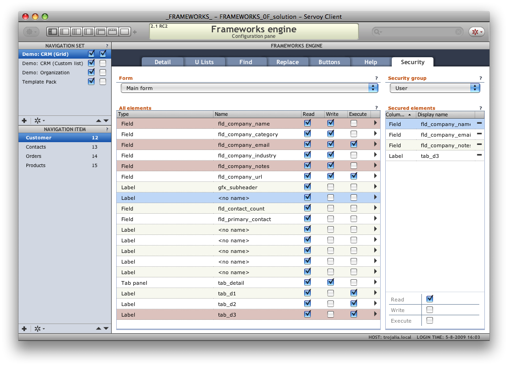
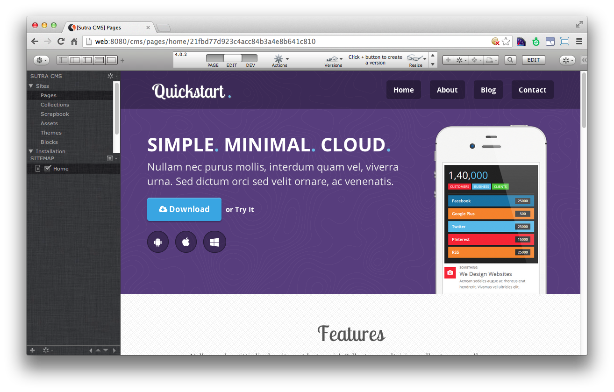

# History

> Not sure where I'm going with this. Currently a place to  scratch an itch and dump some thoughts.

Data Sutra was created circa 2005 in response to the development demands of multiple projects for multiple clients integrating multiple developers using Servoy. In such a scenario, common features and patterns of generic business application development emerged. Solving for these commonalities was critical to our development efficiency, productivity and sanity.

> _Early navigation setup screen_

Originally called "Mosaic Frameworks for Servoy", it featured key time saving modules for security and navigation; solidified naming conventions, coding style, and collaboration approach; and revealed layout patterns for crud, workflows and dashboards. In 2008, it was a featured product at Servoy World in Las Vegas with multiple presentation slots and extended training sessions.

> _Early security setup screen_

With this success iteration in the successive several years was continuous. The GUI was improved dramatically, a module architecture was implemented that allowed for complete loose coupling of modules, API's were born with full JSDocs and code completion, we figured out securing and licensing, and did a lot of work on performance with a build process for client-side data. With Servoy's move to Eclipse with Servoy 5 (okay, Servoy 4 but most people skipped that version), Data Sutra embraced SVN enabling it to be easily shared outside of our core team. 

In use all over the world in all kinds of industries and company settings, we even built a full CMS (Sutra CMS) on top of Data Sutra.

> _Sutra CMS application with Data Sutra_

By 2011-ish, the winds of change were blowing hard and Smart Client was no longer broudly useful. Never big fans of Servoy's Webclient, we tossed around for alternative web solutions. If you lived through that period of time, you know that web development was pretty annoying not matter what route you went with.

With no clear option, with Servoy 6 we embarked on implementing Data Sutra entirely in Servoy's Webclient. As bloated as Webclient was, the hope was that browsers would "catch up" speed-wise and our work would somehow prove more and more useful as browsers became more powerful.

**Just in time to get rolled by mobile.**

The rapid rise of mobile — different screen sizes, woeful connectivity, less powerful processors, quirky browsers — negated any advantage of porting a desktop class application over to the web. In the end, we had a web app (Servoy Webclient) that was slower than our desktop app (Servoy Smart Client) — both of which were for all practical purposes unusable on mobile.

## Future

Even though development was put on ice in 2013, Data Sutra is still deployed. Likely mirroring the story of a lot of Servoy apps.

Servoy 8 has some interesting features that might be worth exploring in order to extend the life of large and critical applications.

[Notes on Servoy 8](http://data-sutra.com/documentation/servoy-08/status.html)

