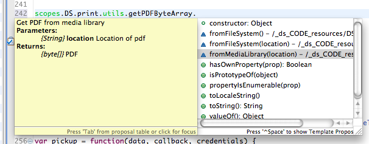

# API

<!-- toc -->

The Data Sutra API provides high level code helper functions, triggers
for UI actions, and meta data handling.

## Usage notes

The Data Sutra API is documented using the latest JSDocs. This gives you
code completion and inline code hinting.

To use in an API function, **start by typing `scopes.DS.`** and
available nodes and functions with a documentation appear as you choose
items.

Additionally, hovering over any item in an API call will bring up docs
for that node or function in a tooltip.

## Reference

### DS.session

Data objects for the current user session. Sub-objects are not listed here as there is a ton of data. You can inspect the contents of each object several ways (see [this post]).

-   credentials
-   solution
-   navigation

### DS.print

Methods to handling printing.

-   preview (reportName,PDFByteArray)
-   download (reportName,PDFByteArray)
-   trigger (registry)
-   utils
    -   convertToPDFByteArray
        -   fromServoyForm(formName)
        -   fromWakandaPage(html file)
        -   fromHTMLData(html)
        -   fromHTMLURL(url)
    -   getPDFByteArray
        -   fromFileSystem(location)
        -   fromMediaLibrary(location)
        -   fromSQLQuery(query string)

### DS.transaction

Methods for handling transactions (web client only).

-   start(record)
-   save(record,onlyRecord)
-   cancel(record)
-   getStatus()
-   toggle(form,toggle)

  [this post]: http://community.data-sutra.com/boards/1/topics/83)