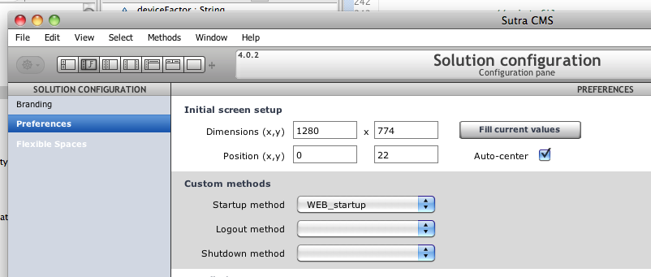
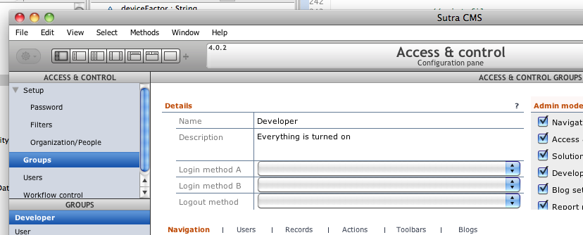

# Bootstrap Hooks

Setting up and tearing down your application can be customized with your
own methods in several spots. Some usage ideas include setting up global
variables, setting up UI state, gathering stats, running reports,
sending notifications, etc.

## Solution preferences

Hooks here are scoped to the deployed application and apply to all users
logging in for all organizations. Available hooks:

1.  Startup method
2.  Logout method
3.  Shutdown method

## Access and Control: Groups

Hooks here are scoped to the group a user logs in as. These hooks run in
addition to the solution preferences hooks.

1.  **Login method A:** code to run before record rules are applied.
    Populate your custom globals here. Do not touch any forms!
2.  **Login method B:** code to run before user interface is shown. It is
    safe to touch any forms in your code.
3.  **Logout method:** run specific logout code for this group.

