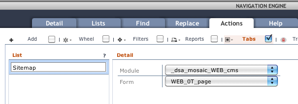

# Layout Manager

<!-- toc -->

## Main panes

### Navigation

The navigation pane lists all the applications and views for a
particular workspace. Multiple workspaces can be setup for a login and
access via the workspace button directly above the navigation pane.

See [Navigation Engine](navigation-engine.html) for how to configure workspaces,
applications and views.

### Universal List

The Universal List pane is a “compliment” pane to the main workflow
pane. There are three ways you can configure this pane.

#### List only

A common use-case is to show a list of records controlling a detail
record view in the main workflow pane.

Because this list view is so common, Data Sutra allows you to configure
this pane with lists without having to code specific list forms for
every detail view in your solution. Additionally, you can configure
multiple lists per workflow form. Multiple lists are accessed from a
control in the title area:

See [Navigation Engine](navigation-engine.html) for how to configure lists.

#### Custom only

You can also configure this pane to show any Servoy form. This is
identical to how you assign a form to the main workflow area.

This approach allows for highly customized layouts. Usage examples:
small monthly calendar picker, summary information, small charts, google
maps, goals for the week, etc.

#### List/custom hybrid

You can have the best of both worlds, universal lists and custom forms
in this pane. When both are present, there is a control in the title
area to switch between views:

To configure, assign universal lists as usual and then head over to
`actions > tabs` to include additional views:

Some ideas for this approach is universal lists augmented by custom
workflows (ex: customized search), views (tree view, calendar view), or
summary information (aggregate info for records in list).

### Workflow

The workflow pane is the main focus point for interacting with data and
getting stuff done. The demo CRM module and our configuration panes
provide some examples (from simple to complex) to kickstart your
creativity in solving business workflows.

See [Navigation Engine](navigation-engine.html) for how to assign a Servoy form to the
workflow area.

## Spaces

### Description

The spaces control group allows the user to focus in on particular
panes:

-   **standard:** shows navigation, universal list and workflow panes
-   **navigation control:** shows navigation and workflow panes
-   **list control:** shows universal list and workflow panes. great for
    many column lists.
-   **list:** maximizes the list pane and automatically includes a link to
    the workflow space on each record. great for many column lists.
-   **workflow:** maximizes the workflow pane

### Resizing

The last button in the spaces control group shows/hides drag areas to
adjust sizing for layout panes.

### Configure

The [Navigation Engine](navigation-engine.md) allows you to turn on/off which spaces are
available per navigation item: 

### User preferences

[Access and Control](access-control.html) allows you to set divider location
preferences per login:

## Toolbars

### Description

This portion of the layout in the header area allows for solution-wide
widgets such as record navigation, weather, and runtime console (which
all come pre-installed)

Switch between controllers with control group buttons on the right side.
If there is a drop-down detail pane associated with the toolbar, the
center button will open and close the drop-down pane.

### Create your own

It is easy to create your own toolbars as they are just Servoy forms.
Some ideas: notifications, custom actions bars, timer, etc.

### Configuration

There is a dedicated Data Sutra configuration pane for assigning
registering Servoy forms to the toolbar area. See [Toolbars and
Sidebars](toolbars-sidebars.html).

### Access and Control

[Access and Control](access-control.html) allows you to turn toolbars on/off per group.

## Sidebars

### Description

The sidebar pane can be opened/closed by the button in the right top
corner of the header section.

Sidebars are similar to [toolbars](#toolbars) in that this pane applied
solution-wide. However, instead of the limited functionality provided by
widgets (simple controls and notifications), sidebars can be complete
workflows. Example ideas: notes, activities, time tracking, shopping
cart, etc.

Note that sidebar workflows are differentiated from main workflows in
that they are not scoped to any particular workspace, application, or
view. They are scoped to the solution and can be accessed from where
ever a user is currently at. Taking this to the next level, sidebar
workflows can implement workflows that access multiple main workflows.
Example: a notes sidebar with a tagging system linking a note to many
different tables and records in your solutions. Clicking on a tag takes
you to that view and record:

### Controls

In the title area of the sidebar pane there is controls for switching
between multiple sidebars and actions related to the current sidebar
showing.

### Create your own

It is easy to create your own sidebars as they are just Servoy forms.
There are also modules in the marketplace that come with sidebar
layouts.

### Configuration

See [Toolbars and Sidebars](toolbars-sidebars.html).

### Access and Control

[Access and Control](access-control.html) allows you to turn sidebars on/off per group.

## Controls

In addition to the control button group for [spaces](#spaces) and [sidebars](#sidebars),
there is a control button group for the Universal List and transactions.

### Universal List

The universal list pane has four control buttons with distinct
functionality: `new record`, `actions`, `filters` and `reports`. With
the exception of the `new record` control, each control can have many
items that are shown in a popup menu when clicked.

Each control has a configuration tab in the [Navigation Engine](navigation-engine.html)
allowing for easy setup of each control. Some run your methods directly,
some are meta data driven.

There are two additional places to access the universal list controls.
Right-click context menu on any row in the universal list:

and in the toolbar:

### Transactions

New for Data Sutra 4.0, we have implemented transaction mode that can be
configured for each view via the [Navigation Engine](navigation-engine.html). When turned
on, a control group in the top right of the header will show buttons for
`edit start`, `edit save`, and `edit cancel`. You can either write your
own code for these actions or leave the method assignments empty to run
our default action for each button.

The default workflow for transactions is when `edit start` is clicked
(or a new record created), we dim out and make un-clickable all the
panes except the main workflow pane. Once edits are complete, you can
either save or cancel the transaction.

