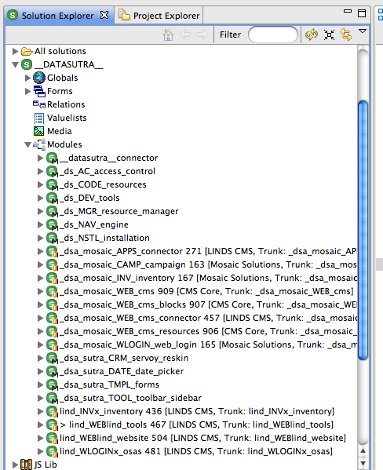
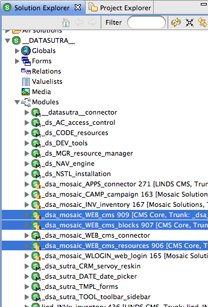
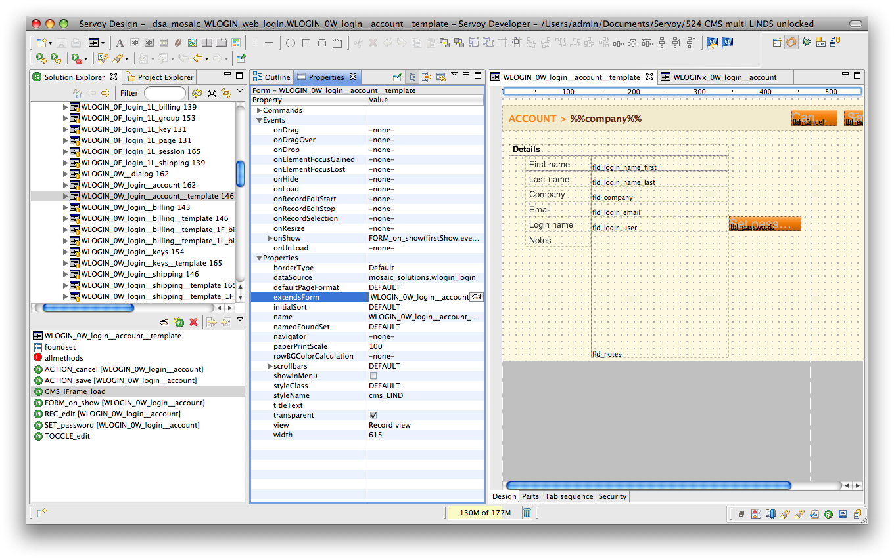
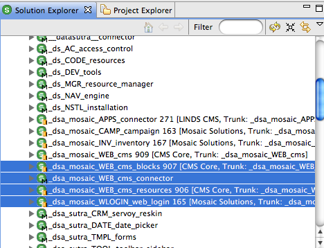
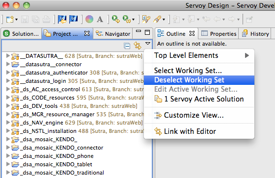

# Modules

<!-- toc -->

Servoy modules is the recommended way of encapsulating blocks of
functionality. Combining modules allows you to build up entire
applications from reusable components.

1.  Module concepts
2.  Extending core functionality
3.  SVN considerations

With a little forethought and planning you can also keep their ability
to be maintained and upgraded intact even when used across many
applications and client projects.

## Concepts

Understanding how Servoy modules work is key to keeping functionality
organized and reusable.

### Chain of command

Combining modules is accomplished by including modules in other modules.
“Parent” modules “see” everything from their “child” modules and can
reference objects from included modules.

However, a child module does not see the parent module and cannot
directly reference objects in the parent module. While a well designed
module hierarchy should largely negate the need to reference objects out
of visible scope, you can use “soft” references to get around scope
limitations.

“Hard” reference:

    `<code class="javascript">forms.WEB_0F_page</code>`

Equivalent “soft” reference:

    `<code class="javascript">forms['WEB_0F_page']</code>`

### Chain rules

##### Circular references are flagged as an error.

A circular reference is when a child module includes its parent module.
Historically, circular references were allowed but Servoy 6 is quite a
bit more strict about this.

##### A module can have multiple parent modules.

As long as you don’t create a circular reference, you can include a
module in many other other modules. This is a handy way to share common
resources (relations, value lists, calculations, helper methods, etc)
with other modules.

### Name spacing

Servoy requires that all objects and methods not associated with a form
have a unique name. This includes:

-   global methods and variables
-   forms
-   relations
-   value lists
-   media
-   calculations

Form object and method names need only to be unique per form.

Modules DO NOT create a unique name space for their included objects and
methods. This makes it very easy to have duplicate names in your
solution after including a module.

This is a deficiency in how modules currently work and we’ve heard
various rumblings over the years on plans to improve this aspect of
modules.

Until then, you are responsible for making sure you don’t have unique
names across modules.

Our approach is to use naming conventions to enforce uniqueness. Each of
our module names includes several characters in CAPS that make up a
unique identifier for that module. We use this identifier as a prefix to
all names inside that module.

Note in this screen shot how the global methods and the form names have
the module identifier as a prefix:


At some point, it seems that just about every language or development
tool requires the programmer to resort to naming conventions to enforce
organization. Modules is where Servoy requires us to use naming
conventions to get around their lack of name space functionality.

### An organized application

An application that comprises of frameworks modules, resource modules,
business application modules, Sutra CMS modules, and various website
specific modules—can easily reach 25+ modules.



The trick to making modules work for you is to keep the focus of each
module very specific and not coding similar functionality in multiple
modules. The following module breakdown is how we conceptualize modules:


The chain of included modules starts at the entry point module and
generally goes down and to the right.

A module must belong to one task grouping (application, business,
generic, extend) and provide unique functionality within that task
group. For example, we wouldn’t create a module for document management
and navigation functionality. On the other hand, we would add FTP
functionality to a document management module if it were limited to a
few methods but a full FTP client with a UI we would separate into its
own module.

This approach to modules has worked very well for us over the years and
provides the right amount of structure to keep us from duplicating too
much functionality and allow us to easily combine reusable modules into
larger solutions.

## Extending Core Functionality

Perfect module organization only works if you have a plan for extending
core functional modules to adapt to specific project and client
requirements. Otherwise, inevitably you end up writing customizations
directly into core functional modules which limits their reusability in
the future.

Here are a number of approaches for extending modules:

1. Addon modules  
2. Method override  
3. Extending forms  
4. Expose an API  
5. Solution model

### Addon modules

An “addon” module is almost a stand-alone module in its own right in
that it contains fully encapsulated functionality. This functionality
though is considered an extension to the functionality of another
module.

Set addon modules to be “children” to the core module.

An example of this approach in action is the Sutra CMS modules.
`_dsa_mosaic_WEB_cms` is the core functional Sutra CMS module and
`_dsa_mosaic_WEB_cms_blocks` is an addon module. It contains all the
code for the CMS blocks that ship with the core product.

Later on, we or anyone else could come up with addon modules for content
workflows, website traffic analysis, products and shopping cart, etc.

The commonality of these addon module examples is that they all extend
the functionality of the core CMS module with discrete functionality
that is best contained in modules of their own.

An easily overlooked issue that arises from this approach is what
happens when you need to access a global method or a relation or a value
list in the core module? You can’t include the core module in your addon
module as this would create a circular reference.

The trick is to not put resources that could potentially be used in
addon modules in the core functional module. Instead, put these
resources in their own “addon” module, include this in the core
functional module, and include as you need in other addon modules.

Again from Sutra CMS, note the `_dsa_mosaic_CMS_resources` module. It
contains all the globals, value lists, relations, and calculations used
in Sutra CMS and it is included in both the core module and the blocks
addon module.



To build your own CMS addon module, just include the CMS resources
module and start coding.

This approach is recommended for all major core functional modules that
you build such as a CRM, project management, document management, etc.
It gives you the flexibility to write core functionality in a main
module and layer on sets of functionality with other modules over time.

See “SVN considerations” below if you have your code under SVN.

### Method override

On the other side of the spectrum from addon module is the method
override technique. It is a targeted one-shot way to override a default
method.

This technique is simple in its direct approach. Run a method from
anywhere in your solution if it exists or run a default method in this
module if not:

```js
    //check for INVx method
    if (globals.CODE_servoy_object_exists("IMAGE_import", "INVx_0C__file_stream")) {
        forms.INVx_0C__file_stream.IMAGE_import(path,1)
    }
    //run default file streaming method
    else {
        forms.INV_0C__file_stream.IMAGE_import(path)
    }
```

This is the code we use to check if a method exists:

```js
    function CODE_servoy_object_exists(methodName, formName) {
        //a method passed in to check
        if (methodName) {
            //a form specified
            if (formName) {
                var smForm = solutionModel.getForm(formName)

                //check to see if form exists
                if (smForm) {

                    //check for method existence on given form
                    if (smForm.getFormMethod(methodName)) {
                        return true
                    }
                    else {
                        return false
                    }
                }
                else {
                    return false
                }
            }
            //no form specified, at the global scope
            else {
                //check for global method existence
                if (solutionModel.getGlobalMethod(methodName)) {
                    return true
                }
                else {
                    return false
                }
            }
        }
        else {
            return false
        }
    }
```


This approach is easiest way to allow a small number of methods to be extended by a method somewhere else in your solution.

### Extending forms

Somewhere in between the addon module and method override techniques is
the extending forms technique. This approach allows you to customize
user interfaces and override functionality on a form-by-form basis.

> Note: future self is no longer a fan of extending forms. It introduces tight-coupling which is almost always not a good idea. In fact, the example given here were the only time we used extended forms and it turned out to be hard to debug and changing code was a fearful process. Typical of tight coupling.


##### Basics

The key to this approach is Servoy’s cool feature that allows a form to
extend another form ([form inheritance](https://wiki.servoy.com/display/Serv60/Inheritance+Model). When you extend a form, your
new form retains all the methods and design elements of the extended
form. In addition to creating new methods and UI elements, you can
override the original methods and UI element properties (but not delete
inherited UI elements).

To extend the functionality of a core module, in another module (ie,
custom client module), extend whatever forms you need and present those
forms instead of the original forms to your user.

##### UI

Since extending forms doesn’t allow you to delete inherited UI
elements—separating logic from UI in the original module adds additional
UI flexibility down the line.

Typically you create a form and add methods and UI elements to it. To
separate logic from UI, first create a form for just methods. Set the UI
to contain no parts and a width of zero. Then create a new form that
extends this form and create your UI on the new form.

In this screen shot note the `WLOGIN_0W_login__account_template` form
which contains the UI and extends the `WLOGIN_0W_login__account` form
which contains the methods:



To override the default UI, extend the “UI” form of the core module to
start with both the original functionality and UI. This works best if
you are reskinning the original UI or just adding new UI elements.

For ultimate UI flexibility, extend the “method” form of the core module
to get a blank form with all original functionality as your starting
point. To this you can copy UI elements from the original “UI” form to
kick start your new UI work.

Here’s a screen shot of showing how we’ve “overridden” the UI of the
previous screen shot using this technique:


### Expose an API

You can expose business logic via [Servoy’s RESTful web services]
plugin. Exposing functionality this way is essentially an API for 3rd
party applications to use. API’s can also be called by other modules
within your solution.

While an API is technically more of a way to interface with a core
module’s functionality, calling an API method and then doing something
more with the results can be considered a way of “extending” core
functionality.


### Solution model

All of the techniques listed so far are design-time approaches. With
Servoy’s solution model, you can create anything you want at run-time.

This approach gives you the most flexibility but writing UI’s entirely
in code also disconnects you from the visual design process.

For this reason, meta data is often used to drive solution model code.
One source of meta data is design-time forms and methods. Grabbing a
design-time form, tweaking a bit, then writing back out to the user—is a
quick and easy way to use solution model code painlessly and
effectively.

### Summary

There are a number of techniques for creating reusable modules and
extending their functionality. If taken into consideration when
designing your modules, they can greatly enhance module usefulness.


## Multi-developer Considerations

The well known reason for putting your code under version control is
enabling multiple developers to collaborate on code easier.

An additional key benefit: SVN combined with reusable modules allows you
to share and modify core code across multiple client projects.

To make this last goal work smoothly there are two things you need to
take into account: how to include modules and managing Servoy Developer
resource projects.

### Including modules

When you include a module in another module, this modifies a file in the
parent module—not the child module. If the parent module is a core
functional module that you are using across multiple client projects,
each of those client projects will see that other client-specific
change.

Servoy references child modules by name, not UUID (a rare instance where
this happens instead of the other way around). We can utilitize this
fact to come up with a solution.

For core functional modules that you expect to be reused and extended by
multiple client projects, create a “connector” module whose only
function is to allow modules to be added to the core module without all
your of your developer environments noting this change via SVN.

To use, include this connector module into your core functional module
and commit up to your SVN repository.

In another developer instance, check out the core and connector modules
into your workspace. Then disconnect SVN sharing for the connector
module while keeping sharing on for the core module.

Include any modules that you use for that client project to extend a
core functional module in the connector module. Other developer
environments will not see this file change as the connector module is
disconnected from SVN across all the developer environments.

To use Sutra CMS as an example again, notice that the CMS currently
comprises of four modules—one of which is a connector module:



This allows us to add client-specific website modules to the CMS
connector module without triggering a file change in the CMS repository.


### Managing resource projects

For each Servoy Developer workspace there is a special project called
“resources” which is where Servoy stores information for database
servers, styles, security, templates, and repository settings:


This resources project is stored in the workspace and by default applies
to all of the modules in your active solution. While it is possible to
change this resources project on a module-by-module basis this doesn’t
work when you have a solution with core functional modules coming from
different SVN repositories—each with their own resources.

The solution is to create an eclipse project for each core functional
module to store its unique resources. Put this project under SVN
control. Then combine all of these eclipse “resource” projects for the
various core functional modules you are using in a solution into your
local default resources project.

This process requires a bit of hands-on management which is best done in
the Eclipse project explorer view:


Note the shared eclipse resource projects specific to various reusable
modules and the unshared Servoy resources project.

Following an update, copy changed files from the shared eclipse resource
projects into the unshared Servoy resource project. While coding, if you
change a resource of a core functional module (ie, add a column to a CMS
table), manually copy the changed file from the unshared Servoy resource
project to the correct shared module’s eclipse resource project and then
commit.

This commit will then show for all other shared developer environments.
They will then need to go through the update and copy to the unshared
Servoy resource projects steps.

Now this may sound like a handful and it is the first few times you set
it up, but with practice it comes naturally and allows you to reuse and
share modules and their associated resources across many client
projects.



(Note: if you don’t see some of your specific resource project folders,
“Deselect Working Set” is available in the menu triggered by the small
downward-pointing triangle button.)

## Summary

Servoy’s module feature allows for many creative options when
architecting large applications. Not only do they help you keep your
code organized, with a little forethought and planning you can write
reusable modules that can be used in many applications and
projects—while keeping their ability to be maintained and upgraded
intact.