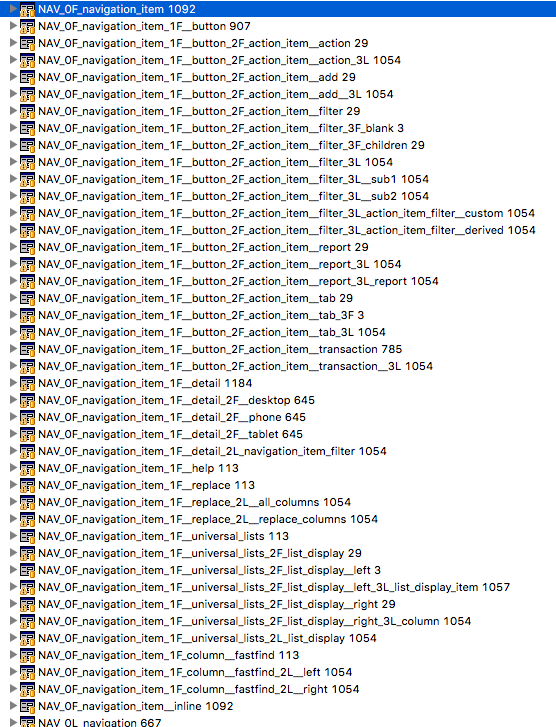
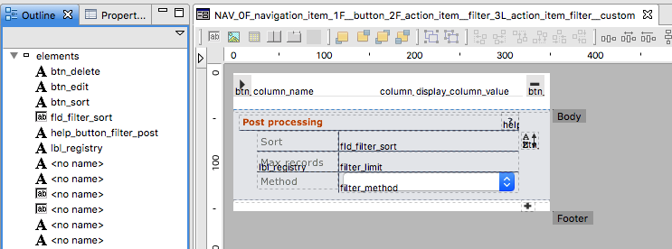

# Naming Conventions

<!-- toc -->	

## 10 things to consider in a naming convention

### 1 Tons of Servoy objects of many different types

You create and name a ton of objects when developing solutions with Servoy. Your solution...modules...database connections...databases, tables and columns...forms...form objects...relations...calculations...value lists...methods...globals and form variables...and finally variables in methods.

### 2 Names must be unique within their object scope

Since you need to be able to find objects in the Solution Explorer

### 3 Be descriptive

In solutions with a number of modules and lots of objects, it's easy to get lost within the object scope. If your names are descriptive within a scope, that can really help.

### 4 Be consistent

Because renaming can be a big chore and confusion is always a headache. 

### 5 Know the Servoy naming quirks

Uppercase, lowercase, camelCase, underscores -- not every style works with Servoy objects. Relations and calculations will convert your uppercase letters to lowercase, most special characters are not valid, etc. A useful quirk is that form events and properties automatically match to a method of the same name. Another Servoy quirk is how to name methods for JUnit testing. Then there is JavaDoc to learn....

### 6 Know your SQL vendor naming restrictions	

It's not just Servoy that you have to worry about, SQL vendors may have their own unique naming restrictions. It helps then to match up your Servoy naming conventions to your SQL vendor.

### 7 Size matters, but not to Servoy

Servoy doesn't have any length restrictions but quite often databases do.

### 8 Use what naming style is comfortable to you and your team	

As programmers, we have all used many different naming styles over the years. Some are more comfortable to us than others.

### 9 Employing different naming styles for different types of objects can help your frame of reference

Since there are so many types of objects, using different naming styles can be a useful to delineator. For example, we use underscore style for most things but use camelCase for method variable names.

### 10 Module and form names benefit greatly from very descriptive names that add additional layers of organization	

This last consideration is consideration #3 on steroids. There are a couple of Servoy objects (specifically: modules and forms) where being VERY descriptive can go a long ways in organizing your solution and workflow. For example, our module names sandbox modules into several categories and contain a unique identifier that is used as a prefix for many of the named object in the module. And our forms are named so that "formsets" are grouped together in the Solution Explorer. 

## Data Sutra style overview

### UPPERCASE

**Code**

Uppercase VARIABLES are used for specifying constant values. While not enforced, values should never be changed after initialization and are considered immutable.

**Module namespacing**

A short uppercase abbreviation is used in the second slot of module names to denote the **namespace** of a module.

With Data Sutra based solutions easily reaching 20+ modules — all of which get combined into one global namespace for an entire solution — this **module identifer** is key to keeping contained objects "scoped" to their module.

**Scopes**

Module scopes start their names with a unique string in uppercase. Resource modules usually have a dedicated scope with the same identifier as the module container the core API of that module.

### lowercase

The only time this style happens is when using camelCase for variables and not needing a second "word" in the name. Sometimes you'll see a form object with just a single lowercase name but that is mistake/laziness where we forgot to add the type prefix to the form object name.

### under_score

This style is used so commonly it can be practically considered our default style. If we're not using one of the other styles, we're using the under_score style.

### camelCase

We use this for method variable names.

### cUs3om (custom)

We use very specific and customized naming styles for two objects -- modules and forms -- to add important layers of organization.

Modules are grouped into three main functional areas (Data Sutra, addons, business); can be split further into types (head, resource); and contain a unique identifier that is used as a prefix for naming objects within the module.

Forms are named by a formula that groups all forms used in a formset together into a hierarchical "bundle". This models how we develop our screens -- some of our screen design patterns comprise of 20+ forms. Having them together in one block with the "head" form at the top saves us loads of time and frustration.

## Naming conventions by Servoy object

### 1 Modules

- Format
	- `category _ unique identifier _ readable name`
- Examples
	- `_ds_NAV_engine`
	- `_dsa_mosaic_WEB_cms`
	- `_dsa_mosaic_WEB_cms_blocks`
	- `strato_SPHERE_game_manager`

**Category**

- `_ds` is used for core Data Sutra modules
- `_dsa` is used for Data Sutra application modules
- `clientID` is used for Client application modules

**Unique identifier (CAPS)**

This identifier is used to prefix most of a modules' objects so that they are uniquely named when combined with other modules.

There are cases where we use the same identifier for more than one module when those modules have strong coupling. Uniqueness accross these modules is usually handled with a sub prefix or just careful naming.

**Readable name**

Finally, it helps if a module name has a descriptive section.

### 2 Database connections

- Format
	- `clientID _ descriptive name`
- Examples
	- `sutra`, `sutra_example`, `sutra_log`
	- `sutra_cms`, `mosaic_solutions`
	- `data_linds`, `strato_game_data`

Data Sutra requires the first three database connections listed. All other database connections are assumed to be data buckets for various application modules.

Convention is to name these data buckets either after a client or an application.

### 3 Databases, tables and columns

Databases are organized per sizeable chunks of functionality and are named accordingly. Additionally, there is often a prefix to associate a database with a client. 

- `linds_sutra`
- `linds_sutra_cms`
- `linds_mosaic_solutions`

Tables are named per logical data bucket and can have a prefix to namespace the tables. Where multiple tables are used to store a functionality grouping, one or more grouping names are used as prefixes.

- `sutra_access_action`
- `sutra_access_filter`
- `sutra_access_group`
- `sutra_access_group_action`

Columns follow a similar pattern to table names. Some common grouping prefixes are `date_`, `id_` and `rec_`.

> Note: prefixes are never put at the end of a name. For example 'tablename_id' should be 'id_tablename', even for foreign keys

### 4 Forms

- Format
	- `module prefix`
	- REPEAT for each "depth" form is located
		- `level` -- 0 to 9 for depth, R for reusable, P for dialogues
		- `type` -- F for form, L for list, T for table
		- opt unique form set `identifier`
		- `table name` (opt on repeat if table name is the same as leve prior)
		- task (opt)
	- END REPEAT

Forms compose together in Servoy via `tab panels` to create complete UI's. Even simple UI's typically have several contained forms.

This situation is increased additively as multiple forms are assigned to `tab panels` and multiplicatively as forms contain forms that contain even more forms that contain forms ... etc.

We call a set of forms that make up one discreet UI a **form stack**.

In the following screen shots you can see a form stack comprised of seven forms:

`WEB_0F_asset` contains `WEB_0F_asset_1F` in the first tab panel and forms `WEB_0F_1F__tags` and `WEB_0F 1L_page` in a second tab panel.

`WEB_0F_asset_1F` contains `WEB_0F_asset_1F_2L_asset_instance` and `WEB_0F_asset_1F_2L_asset_instance_meta` in tab panels in a splitter.

The result:

The naming convention for forms models the composable nature of Servoy forms while keeping them in order alphabetically in the Solution Explorer pane.

A more extreme example:

### 5 Form elements

> Note: form elements need not be named unless they are used in scripting

- Format
	- fld_ ...
	- btn_ ...
	- tab_ ...
	- bean_ ...
	- help_ ... -- special help button
	- gfx_ ...
	- lbl_ ...

### 6 Relations

- Format
	- `MODULEPREFIX` \_ `standard_name` __ `unique_task`

### 7 Calculations

Same as column names.

### 8 Value lists

- Format
	- `MODULEPREFIX` \_ `GROUPING` \_ `functional label`

### 9 Methods

- Format
	- `ACTIONTYPE` \_ `action`
- Action types
	- FORM, REC, FILTER, FLD, FX, TAB, etc

### 10 Variables

- `camelCase` for non-constant variables
- `UPPERCASE` for immutable constants

### 11 Global variables and form variables

Same as variable naming except with the addition of global identifier prefix for global variables and a form prefix for form variables.

