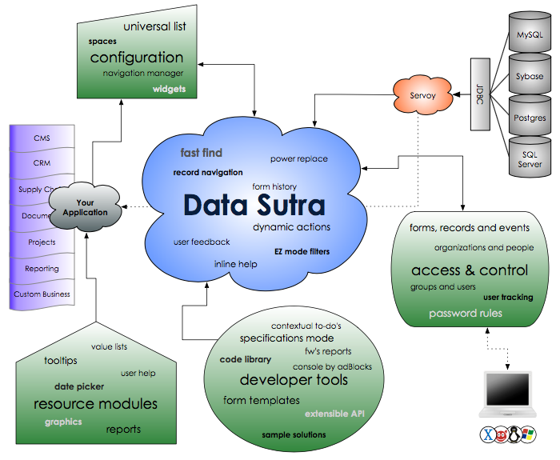

# Philosophy

<!-- toc -->

Data Sutra is a complete business application management platform for
Servoy. It provides structure, organization, functionality & GUI for
your Servoy solutions. And it has been honed and tested against many
projects, developers and clients.

**Value to you?**

1. Code right the first time  
2. Minimize unforeseen hurdles  
3. Focus on just building your workflows

## Goals

1. Adhere to DRY principles  
2. Make things easier for the developer, not harder  
3. Greatly accelerate writing business applications  
4. Bring cutting edge client techniques to the average developer

## Concepts

### Separation of the GUI, solution and business layers

-   untangle your solutions
-   reusable resources
-   multi developer friendly
-   code readable
-   manage large solutions

### Meta-data driven

-   de-couple functionality from code
-   configure new projects fast
-   projects grow without spaghetti code

### Standardized GUI

-   build good looking forms fast
-   pre-defined styles for all Servoy objects
-   consistent UX across all of your views
-   win your users over
-   easy user learning curve
-   latest web client usability

### Starter templates for a variety of workflows

-   build forms even faster
-   utilize establish data organization patterns

## Organization

### API and naming conventions

-   find things easily
-   conform to conventions

API details: [API](api.md)

### Clearly defined module dependencies, interactions, and extensibility

-   DRY (don’t repeat yourself)
-   separate functionality into modules knowing you won’t create
    headaches for yourself later on

## Included functionality

### Layout manager

-   main panes: navigation, universal list and workflow
-   spaces: users can change the layout to focus on various panes
-   toolbars: solution-wide widgets
-   sidebars: solution-wide workflow forms
-   controls: add, actions, filters, reports, and transactions button
    groups

Full details: [Layout Manager](layout-manager.md)

### Flexible and powerful navigation engine

-   set up and modify application workflows fast
-   control user views
-   combine many applications into workspaces
-   navigation is not a bottleneck for growing your solution

### Universal Lists

-   configure powerful lists with no coding
-   assign multiple lists to views

### Fast Find

-   less confusing than Servoy’s default find mode for users
-   always in the same place
-   completely configurable with no coding necessary for each form
-   covers 90% of all searching needs right out of the box

### Find and Replace

-   update data across many records
-   configurable: no coding
-   restrict to only those with access

### Filters

-   setup powerful filters with no coding
-   static filtering by values
-   dynamic filtering by logic (assign a method as the filter input)

### Reporting

-   custom pdf report web viewer: view, resize, print, download, etc.
-   api’s to easily convert any report to a pdf
-   configuration pane to organize your reports
-   assign reports to any view

Full details: [Reporting](reporting.md)

### Access and Control

-   3-tier restriction plan: views, records and functionality. Assign
    what a user can see, what records they have access to, and what they
    can do while there.
-   SaaS deployment capability with organization and user abstraction
-   bank-level password controls
-   connection to external users store
-   logging of all user actions
-   realtime session monitoring
-   login widget to include on external websites
-   data encrypted from point to point via HTTPS
-   login preferences

### Solution configuration

-   branding
-   various overall preferences

### Registries

-   organizations and users
-   tooltips
-   value lists
-   i18n
-   applications

