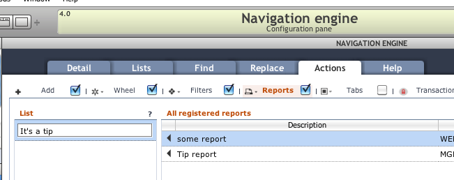

# Reporting

<!-- toc -->

There are many ways to create reports for Servoy solutions. However you
choose to generate your reports, in the end Data Sutra needs a PDF to
display within our web client.

Our API has two main methods to preview and download pdf’s and several
methods to convert sources to PDFByteArrays to pass into the main
methods.

## User experience

Our in-browser pdf viewer is a slightly modified version of
http://mozilla.github.com/pdf.js/. Some of the main features are:

-   same look on all browsers
-   print preview with buttons to print and open in another window
-   works on tablets
-   easy jump to a page and page thumbnails
-   view zooming
-   searching

## API

scopes.DS.print…

-   preview (reportName,source)
-   download (reportName,source)
-   trigger (registry)
-   utils
    -   convertToPDFByteArray
        -   fromServoyForm(formName)
        -   fromHTMLData(html)
        -   fromHTMLURL(url)
    -   getPDFByteArray
        -   fromFileSystem(location)
        -   fromMediaLibrary(location)

## Report registry

Data Sutra has a configuration pane for reports. Once your reports are
registered, they can be assigned to the `reports action button` in the
`navigation engine`.

### Dedicated reporting module

We recommend that you create a module dedicated to reports for your
particular solution and/or client. This keeps your report code in one
place and separated out from all of your other business logic. As you
will see in the following sections, wiring in reports from your module
to various places in the UI is easily done with Data Sutra configuration
panes.

### Configuration pane: Report registry

Each record represents a report and has options about where the report
is coming from and how it should be run.

If your report is based on a Servoy form, choose the module and form.

-   If you specify a method, that method is run when the user chooses
    the report. You are responsible for calling our API to preview or
    download the report in your method. *This approach allows for
    complex reporting logic.*
-   If you don’t specify a method, we apply a default printing action to
    the specified form and show it in our pdf previewer. *Simple
    reporting logic.*
-   If you check the checkbox, we throw up a dialog asking the user to
    select `record | foundset | current search results`. This is passed
    to your method (if specified) or our wrapper will react accordingly.
    *Adds some basic options to the simple reporting logic.*

As of 4.0.2, we’ve added a URL data point. If not null, it will be
passed into your specified method. If no method, our wrapper will
automatically show the URL in our pdf previewer.

Lastly, the `key` column is there so you can reference a registered
report with the scopes.DS.print.trigger(`key`) api method. This enables
you to run a report from within your own business logic.

## Assigning reports into the UI

There are two places where reports can be triggered from: from our
`reports action button` or your business code.

### Configuring `reports action button`

Once a report is registered, it is available to be assigned to any
`reports action button`. `Reports action buttons` are accessed in the
`Navigation engine` configuration pane, then `Actions` tab, then
`Reports` tab.

Click the checkbox on the `Reports` tab to turn the reports action
button on.

The configuration pane shows a list of registered reports and a list of
reports assigned. Move items from the registered reports list to the
reports assigned list and enter a label name that will be displayed in
the popup menu for that report.

### Triggering a report from your code

Use trigger(key) api method to run any registered report from within
your own business logic. This method will run the report with all the
options specified in the report registry.

Reporting approaches
--------------------

> Copied from Scott Buttler’s Servoy forum post:
https://www.servoy.com/forum/viewtopic.php?f=9&t=19350\#p104122

### Built-in

You can build Servoy Forms using Title Headers, Headers, Footers,
Summary, etc and build a report. This model’s the FileMaker Pro way of
doing thing if you are familiar with that.

### Manual

You can of course retrieve the data on your own, and write data our in
HTML, Excel, or PDF. This is old school and should generally not be
done.

### Jasper Reports

This is really the standard for reporting in Servoy and is now the vast
majority of users do it. You can use a visual iReport design tool which
will connect to your data via raw SQL, FoundSets, or DataSets, and can
pass parameters into the report.

### Velocity Reports

This is an open source plugin using the Velocity Engine. Reports are
built in XHTML using special templating functions

https://www.servoyforge.net/projects/velocity-report

Velocity vs Jasper/iReports discussion:
https://www.servoy.com/forum/viewtopic.php?f=15&t=19448

### Any other SQL Tool

Since Servoy connects to a SQL Database, you can use other tools and
call them, like SQL Server Reporting Services, Crystal Reports, etc.

