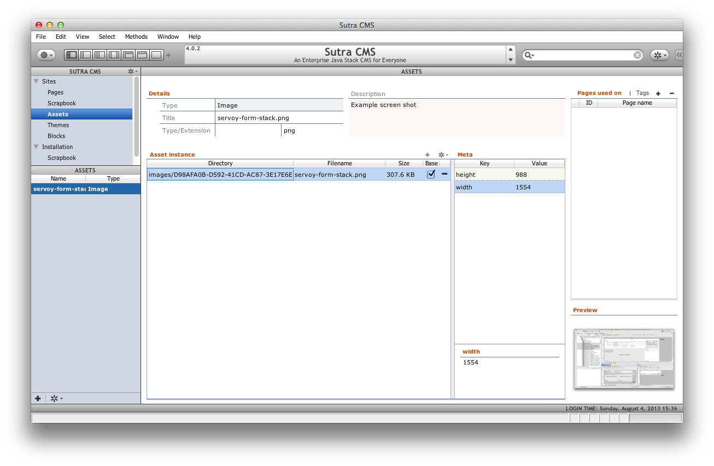
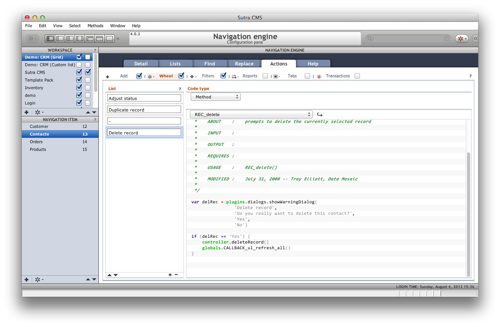

# Your First App

<!-- toc -->

## Concepts

Data Sutra is a collection of modules that are in your workspace after
installation. Various modules provide different functionality and are
encapsulated into modules to organize development on our end.

However, you only have to worry about two things: how to add Data Sutra resources into your app and how to add your app into the Data Sutra framework. From there on it is all configuration.

## Create a module

It is a good idea to put all of your code—relations, forms, fields,
value lists, etc—in your own module instead of modifying or extending
one of ours.

*(Reminder from install instructions: it is also good practice to create your own database connection to store your apps data in instead of adding tables to one of our connections.)*

Besides keeping your code organized and away from ours, your own modules allow you to use your flavor of team sharing (SVN, GiT, Mercurial, etc) and upgrade Data Sutra independently of your code. If you want to live on the cutting edge, you can even hook up our modules to their respective open source SVN repositories and pull down changes as they are made (not recommended unless you’re on a project with us or you think breaking things is fun!).

### How to create a module

1.  Right-click on the “All Solutions” node of the Servoy Explorer pane
    and “Create new solution”. You will go through a short wizard to
    name your solution/module.  
    
2.  Set the `solution type` of your new module. Set this to `Module`.
    This will allow your code to run in both smart and web client.
    Alternately you can choose smart or web client only settings.  
    

### Naming conventions!

> See [Naming Conventions](../developer-guide/naming-conventions.html)

What/how you name your module isn’t really important except that it has
to be a unique name within the activated set of modules comprising of
Data Sutra and your modules.

Where naming becomes important is that many of the names for objects
(forms, relations, value lists, etc) your module contains also have to
be unique across—you guessed it—the activated set of modules comprising
of Data Sutra and your modules.

A simple way to avoid naming collisions is to prepend all of your object
names in a particular module with a unique identifier for that module.
To make it easy for you to remember the unique identifier for your
module, put the identifier in the module name in CAPS.

A quick glance at a Data Sutra module list shows it all working in
practice:

## Include Data Sutra resource module

Including modules is a great way to share code across modules. Including
the Data Sutra resource module gives you quick access to the Data Sutra
styles, API, helper functions, etc—just like you created all that code
in your own module.

### How to include

1.  select your module in the `Solution Explorer`
2.  go to the properties pane
3.  select the `moduleNames` property
4.  add the module `_ds_CODE_resources`

### Important considerations

Cyclical module inclusion is not allowed! So for example, after
including a resource module in your module—don’t include your module in
that particular resource module.

This restriction impacts how you organize and structure solutions for
the most amount of flexibility and code reuse. As applications grow in
size, the more impact good structure has (or bad structure!).

A couple of tips:

1. A you develop more and more generic routines over time you should
split those out into your own resource module so you can share them
between your business modules.

2. Typically, a single business module will include GUI layer stuff such
as forms; model layer stuff such as entity methods, relations, value
lists; business logic stuff in the form of various methods; and security
stuff such as who can do what, when and where.

If you create another business module and you notice yourself
duplicating any of those layers to get going with the new module
(typically the model layer; ie. duplication of relations), also putting
that stuff in a resource module will allow you to use the same stuff in
both modules.

You can start to see that there is a method to the madness of the module
list that comes with Data Sutra. For the noob, don’t worry about it for
now and just put all your code in one module. With Data Sutra, the only
mess you can make is restricted to your own module! (We get to deal with
our own messes….)

## Your turn!

Servoy is a form-based development environment. Forms are your GUI
canvas where you add various UI and functional components. Additionally,
you can create and store methods at the form level. Methods at the form
level “know” everything about the form without having to reference the
form explicitly. For example, if a form is bound to a data source all
you have to do to reference a column in the data source is type the name
of the column: `var firstName = name_first`.

### Your first form

Forms can be displayed as the top level page by either setting it as the
startup form of your app or navigating to a form with navigation code
(or picking from the toolbar in smart client).

In Data Sutra, you assign your form to a navigation item in the
`Navigation Engine` configuration pane. You also assign viewing
privileges in the `Access and Control` configuration pane to groups.

### Forms as components

Forms can also be displayed on other forms via the tab panel component.
In this way, you can combine many forms together (and many levels
“deep”) to build up a complex interface that looks like one page to the
user. We often use the term “form stack” to refer to all the forms that
make up one interface.

### Forms and data binding

Forms can be bound to a data source. The most common data source is a
table in a SQL database. When forms have a data source, when you place
field components onto the form they can be assigned to the form’s data
source columns (or related columns). Forms and fields together are the
basic level of design-time data binding in Servoy.

Forms have a `view` property that you can set to one of the following:
`Record view | List view | Table view`. Record view shows one record at
a time while the other two views show the current collection of records
(whatever is in the table with whatever searches you may or may not have
applied).

### Events and properties

Every object in Servoy has their own unique events and properties that
defined the behavior of that object.

Properties are usually set at design-time and can be modified at runtime
with methods. Events are the hooks where you attach your methods.
`onShow` and `onRecordSelection` are form events that we seem to use the
most.

### Code

There are a lot of places to store code at in Servoy: globals, scopes,
tables, calculations, and forms.

Typically, code stored at the form level is where your app’s heavy
lifting is done. You may be validating a particular piece of data,
guiding the user through a process of steps, munging together complex
data structures, etc. This kind of code can get messy (for good reasons)
and usually has no use outside of what is being done right there.

As you develop code that is more abstract and reusable, store this code
somewhere besides on a form. For easy reference a `scope` (named global)
is a good place. If your code functions as a business rule for your
data, store as a table method (and hook up to a table event so it is run
no matter what else is happening).

Lastly, methods stored on your form can be easily attached to Data
Sutra’s action buttons in the `Navigation engine`. This frees you from
having to create your own buttons on your forms to wire up common
functionality. This helps keep your UX consistent across all your forms.
And what action buttons do exist on a particular form are then
automatically assumed to be very form-specific functionality.

### UI

If you suck at making nice user interfaces, you’re hardly alone. Even
for really good designers, coming up with a new UI from scratch is a
laborious process. So…

***DON’T START YOUR UI FROM SCRATCH***

The mere fact that your forms end up inside the Data Sutra layout
manager gives you a starting edge. However, there are a number of things
you can do when working with forms that will make the creative process
go easier.

##### 1. Use our grid theme

Set the style of your forms to “*DATASUTRA*”. This gives you a style
sheet for development that translates into specific style sheets for
each smart client platform (Mac, Windows and Linux) as well as for the
web.

In addition to default styling for objects such as the form, comboboxes,
tab panels, row background colors, etc—there are multiple style classes
you can choose from for objects such as labels and fields. A
click-through of the objects on one of our sample forms while keeping an
eye on the `styleClass` property will give you an idea of the options.
Stray from our style class options at your own risk! It’s a dangerous
world out there and who likes to think that hard? (Don’t touch that
color picker…don’t do it!)

##### 2. Line !@\#$ up you lazy bastard

Seriously, why do I even have to say this. Because programmers are the
only people I know where I repeatedly find objects dumped on a screen in
haphazard fashion. It’s like we all grew up never having to clean our
rooms. Or when we did, we threw everything in the closet.

Please don’t subject the rest of the world to your crap. Clean it up.
Make sure objects align. Don’t make one field slightly bigger than
another. Don’t plunk a button down in the middle of the screen. Do your
best to hide the fact that you’re not a normal human being.

##### 3. Anchor elements

Within a form there are various sections and groups of components.
Making sure the various groups expand/contract and go where they’re
supposed to go when the window is resized is just good practice.

##### 4. Organize your data

Not all data is created equal. So don’t go putting the year-end profit
goal field next to the first name field. Yes, I’m talking to you over
there.

Take a look at one of the prior screenshots and notice how we’ve
organized the data into the following buckets:

-   detail
-   informational
-   meta
-   related
-   summary

##### 5. Choose a workflow focus for your form

We’ve also arranged the data types from top-left to bottom-right in
order of most discrete to least discrete. This is the arrangement we
typically use for forms that handle CRUD types of interactions. Other
types of interactions (dashboards, drill-down reporting) may have this
order flipped: start with the most top-view data and end with a list of
all the items (for example).

Don’t try to implement multiple workflow focuses with one form. It’s
pretty hard to create something that is easy to use for both data entry
and reporting. But you can trigger reports from a data entry screen. Or
you could drill down from a report to the details, change a data point
and view the report again.

Focus on one thing doesn’t mean don’t use the other things, just use the
other things sparingly.

##### 6. Don’t start with a blank form

Duplicate one of our forms. Sometimes it’s easier to cut stuff out than
it is to add stuff in.

##### 7. Use our form tab panel controllers

For tab panels we don’t use the default tabs. This is accomplished by
setting the `tabOrientation` to `HIDE` and rolling our own tab
controller via a combination of labels, naming conventions, and some
default code.

Now this one deserves a wiki page all its own but for now if take a look
at one of our many examples, note that it all relies on the name of the
tab panel and the names of the labels used at the controllers for the
tab panel. Then it’s just one generic method attached to all of the tab
labels to make it work.

##### 8. Use our tab panel action buttons

Notice that in the previous screen shot there was a **+** button at the
top of the tab panels for and action (new record) that is applied to
each list in the tab panel. Now this is a special case to implement
because the button itself is on the form the tab panel is one while the
`new record` action to be run are methods on the forms attached to the
tab panels.

One way to do this would be to write a method on the parent form that
called each of the sub-form methods based on what form is in which tab
slot. We’ve gone a step further and have written a generic method that
you attach to the + button that looks for the method named “REC\_new” on
the sub-forms and runs that method for whatever form is currently
showing in the tab panel.

This approach can even be used when you want the “wheel” action bottom
(drop down list of actions) applied to a tab panel. The method attached
to the “wheel” button calls methods by naming convention on the tab
panel sub forms. The sub form specific methods are responsible for
loading the popup menu list and running code when a list item is
selected.

These pics show completely different sets of actions depending on which
tab panel item is active.

**Summary**

Creating a good UI is not a function of how creative you are. Creating a
good UI is a function of applying engineering best practices to a design
that has already been created and tested.

## Connect your module to Data Sutra

Once you connect your module up with Data Sutra, all of Data Sutra’s
setup and configuration panes know all about your module.

### How to connect your module to Data Sutra

1.  make sure the main Data Sutra module is activated (`__DATASUTRA__`)
    in the `Solution Explorer`
2.  under the `Modules` node, select the `__datasutra_connector` module
3.  go to the properties pane
4.  select the `moduleNames` property
5.  add your module
6.  restart smart client if you already have it open

## Configure navigation

Data Sutra’s `Navigation Engine` configuration pane is the centerpiece
of a Data Sutra application.

### Bare minimum configuration

1.  create a new workspace
2.  create a navigation item
3.  assign a form from your module to `Desktop > Workflow`

### Universal List

To enable our no-required-list to go with your form:

1.  check on `Desktop > Use UL`
2.  go to the `Lists` tab and configure your lists

### Fast find and Replace

To enable our default searching capabilities for your form:

1.  go to the `Find` tab and configure fast find items
2.  go to the `Replace` tab to configure power find and replace
    functionality

### Wire in workflow actions

To hook your workflow methods up to our action buttons:

1.  go the `Actions` tab and connect your methods up our `Add` and
    `Wheel` buttons
2.  add your reports to our `Reports` button
3.  configure quick filters that will show up on our `Filters` button
4.  turn on transaction mode for your form (default code already
    implemented which you can override)

## Configure security

If you have `Access and Control` (a configuration pane) turned on, you
will need to add your new workspace and associated navigation items to
the group privileges for a user to have access to your new app!

### How to add to a group

1.  open up the `Access & Control` configuration pane
2.  go to `Groups`
3.  on the `Navigation` tab, add your workspace (“navigation set”)
4.  relogin

## Some final thoughts

### The collaborative iterative process

Because you can so quickly put together a useful workflow with Data
Sutra, the iterative process involving input from your users and other
stakeholders can be very collaborative.
Code-test-code-test-deploy-test-spec-test-etc and so on can be done in
such a way that everyone knows what is going on and can have a say.

### Value proposition

On the simple side, Data Sutra allows you to quickly setup navigation,
core functionality, and security for you forms. Advantages:

1.  full application from the start of your coding process
2.  a LOT of code you don’t have to write
3.  easy to reconfigure
4.  won’t run into trouble as your application grows

On the complex side, you probably have noticed a bunch of advanced
options as you’ve perused the various configuration panes. SaaS setup,
security with workflow controls, custom record filtering, branding,
create your own toolbars and sidebars—the list goes on and on.

So for all its easy of use, Data Sutra won’t limit your future
possibilities.

### Approach comparison

You may have heard of or run into the “extend form” approach to
frameworking with Servoy. Servoy’s ISV framework uses this approach for
example.

The basic idea is that when you create a form, instead of creating a
blank form from scratch you “extend” a set of base forms. Your form then
has navigation, security and whatnot available right at your form level.

This differs from our approach in that we don’t add all that stuff to
your form. You add your stuff to our stuff instead. We feel our approach
allows you to focus better on writing just the code for your business
workflow without being bothered with what the application framework does
for you. Of course within your own workflow form, you can split out
functionality into various forms and extend those forms. So you get the
best of both approaches with Data Sutra.

