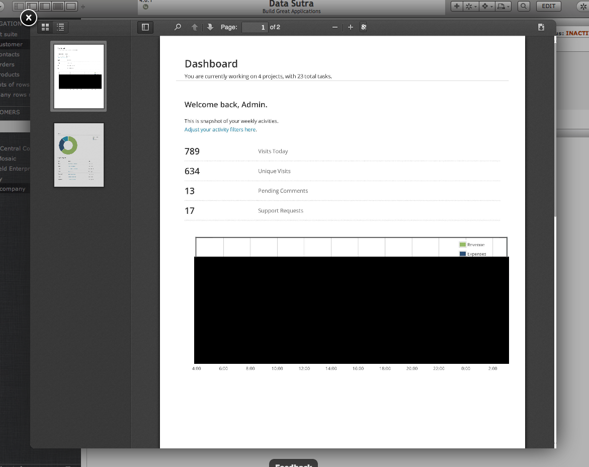
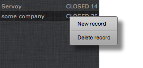

# 4.0.1 Release Notes

##### Brand new pdf viewer

- same look on all browsers
- print preview with buttons to print and open in another window
- works on tablets
- easy jump to a page and page thumbnails
- view zooming  
- searching

##### Browser compatibility additions

- firefox  
- IE 10

##### Minor features

- when google analytics present, track navigation item changes
- api for start/stop centered spinner (scopes.DS.webClockerCentered)
- UL right click to get context menu of configured actions  
- placeholder property

##### CSS changes

- list views  
- comboboxes in tables

##### Fixes and performance

- various minor bug fixes  
- lazy loading some client-side libraries after login
