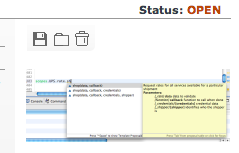

# 4.0.2 Release Notes

##### Router v2

-   url now shows down to the record level
    -   url scheme: workspace/view/pretty-record/pk
        -   example:
            http://demo.data-sutra.com/developer/customer/rentfield-enterprises/141
    -   link directly to individual records
    -   google analytics tracks navigation to record level

##### Reporting enhancements

* report registry now takes html data and urls
* automatic converting html to our pdf previewer
* new api methods to make coding reports for the web easier

```
    scopes.DS.print
        preview (reportName,PDFByteArray)
        download (reportName,PDFByteArray)
        trigger (registry)
        utils
            convertToPDFByteArray
                fromServoyForm(formName)
                fromHTMLData(html)
                fromHTMLURL(url)
            getPDFByteArray
                fromFileSystem(location)
                fromMediaLibrary(location)
```

-   new view created to demo/test reporting api calls. see in action:
    http://demo.data-sutra.com/developer/report
-   new wiki page on reporting:
    http://community.data-sutra.com/projects/datasutra/wiki/Reporting

##### UI upgrades

-   override servoy’s default media field controls with good looking
    graphics  
    
-   new toolbar flipper graphics  
    
-   new combobox look applied to tables

##### Misc functionality

-   fast find has new options to search on: all text, all number, all
    date

##### Servoy 6.1.4i1

-   tested and refactored for latest version of servoy: 6.1.4i1
-   globals refactoring for developer builder speed
-   worked with servoy on enhancements to custom api’s to make them more discoverable and usable
    -   inline documentation hinting while code completing
    -   outline view shows internal api methods
    -   see scopes.DS.print API for examples

##### New requirements

-   Velocity Reports plugin:
    https://www.servoyforge.net/projects/velocity-report
-   Servoy 6.1.4i1 (not downloadable, need to add to update sites:
    https://www.servoy.com/developer/61x\_updates/intermediate)
