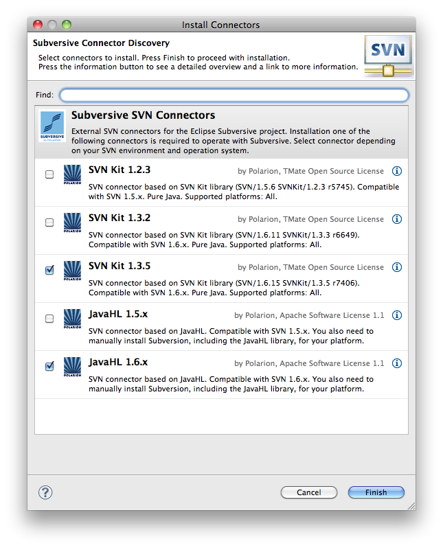

# SVN Setup

## Servoy 6

As an alternative to the posted stand alone installers in the Files
section, you can hook directly into our SVN. The link is:

https://data-mosaic.svn.beanstalkapp.com/sutra/

You’ll need to setup SVN in Servoy. A somewhat outdated tutorial for mac users is on [Servoy Magazine](http://www.kabootit.com/home/2010/06/tutorials-install-subversion-for-servoy-5-on-mac.html)

**Here is our most recent cheat sheet for Servoy 6.1: [servoy 6.1 SVN setup on mac](../attachments/servoy 6.1 SVN setup on mac.rtf)**

For first time install, we recommend that you install from the files
first (so your database tables are built automatically), then pull down
(and replace workspace contents) with relevant SVN projects.

Servoy 7.0.1 notes
------------------

Use this update site: http://download.eclipse.org/releases/indigo  
Expand the Collaboration group  
Select Subversive SVN Team Provider  
Go through install process and restart  
Open SVN perspective (need to use the + toolbar button)  
Choose native javaHL 1.6.x (don’t choose if installer doesn’t like
you.)  
Choose SVNKit 1.3.5  

Go through install process and restart

